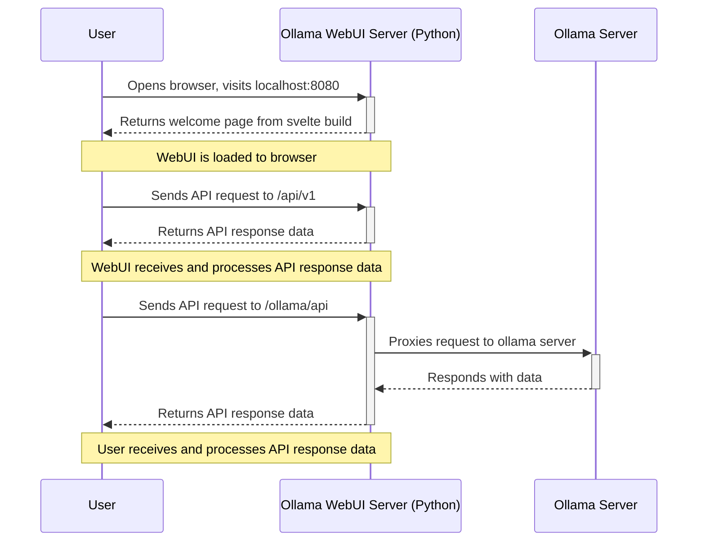

# Project workflow

[](https://mermaid.live/edit#pako:eNq1k01rAjEQhv_KkFNLFe1N9iAUevFSRVl6Cci4Gd1ANtlmsmtF_O_N7iqtHxR76ClhMu87zwyZvcicIpEIpo-KbEavGjceC2lL9EFnukQbIGXygNye5y9TY7DAZTpZLsjXXVYXg3dapRM4hh9mu5A7-3hTfSXtAtJK21Tsj8dPl3USmJZkGVbebWNKD2rNOjAYl6HJHYdkNBwNpb3U9aNZvzFNYE6h8tFiSyZzBUGJG4K1dwVwTSYQrCptlLRvLt5dA5i2la5Ruk51Ux0VKQjuxPVbAwuyiuFlNgHfzJ5DoxtgqQf1813gnZRLZ5lAYcD7WT1lpGtiQKug9C4jZrrp-Fd-1-Y1bdzo4dvnZDLz7lPHyj8sOgfg4x84E7RTuEaZt8yRZqtDfgT_rwG2u3Dv_ERPFOQL1Cqu2F5aAClCTgVJkcSrojVWJkgh7SGmYhXcYmczkQRfUU9UZfQ4baRI1miYDl_QqlPg)

